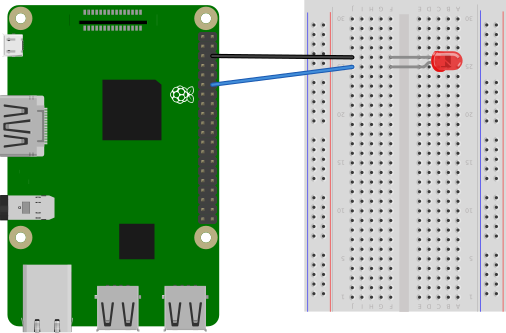
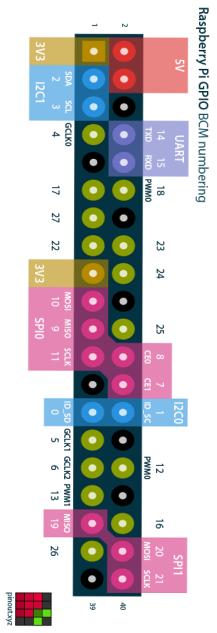
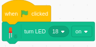
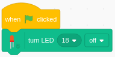

# Controlling an LED

Within this tutorial you are going to learn how to create a simple circuit and using the Raspberry Pi and Scratch3 to control an LED.

## What You Will Need

The equipment you need is:

* 1 x LED
* 2 x Male to Female jumper wires
* 1 x breadboard
* A Raspberry Pi

## Creating The Circuit

Let's create the electronic circuit that we are going to control using Python and a Raspberry Pi.

The Circuit will look like this:

 

**NOTE:** The LED has one short leg known as the cathode (Negative = -) and one long leg known as the anode (positive = +)

The Anode is connected to pin 18 on the Raspberry Pi
The Cathode is connected to ground on the Raspberry Pi

Once the LED is wired to the Raspberry Pi this completes our electronic circuit.

We can now code our LED to do something.

## Coding The LED

### Turning The LED On

1. Open up Scratch3 by clicking on Raspberry Pi Menu > Programming > Scratch3.
   If you don't have Scratch3 installed you can install it by going to Raspberry pi Menu > Preferences > Recommended Software. Click on Programming and scroll down to Scratch3. Click on Scratch3 then click OK. 

2. Click on **Extensions** 

3. Click on **Raspberry Pi Simple Electronics** 

4. Click on **Events**, click and drag a **when green flag clicked** block to the code area and drop it.
   
5. Click on **Raspberry Pi Simple Electronics**, click and drag a **turn LED 0 on** block to the coding area and attach it under **when green flag clicked** block.
   
6. Click on the **0** and pick **18**.

Your code should look like this:

To run the code click on **green flag** above the cat.

You should now see the LED turn on.

### Turning an LED Off

To turn the LED off click on **on** within the **turn LED 18 on** block and click on **off**.

Your code should look like this:

Now Click on the **green flag** to see the LED turn off.

### Making an LED Blink

1. Click and drag **turn LED 18 off** block to the coding menu to delete it.
   
2. Click on **Control**, click and drag a **forever**block to the coding area and attach it under **when green flag clicked** block.
   
3. Click on **Raspberry Pi Simple Electronics**, click and drag a **toggle LED 0** block to the code area and drop it within the **forever** block.
   
4. Click on **0** within the **toggle LED 0** block and pick **18**

Your code should look like this:

Now click on the **green flag** to see the LED blink on and off.

You now know how to control an LED using a Raspberry Pi and Scratch3